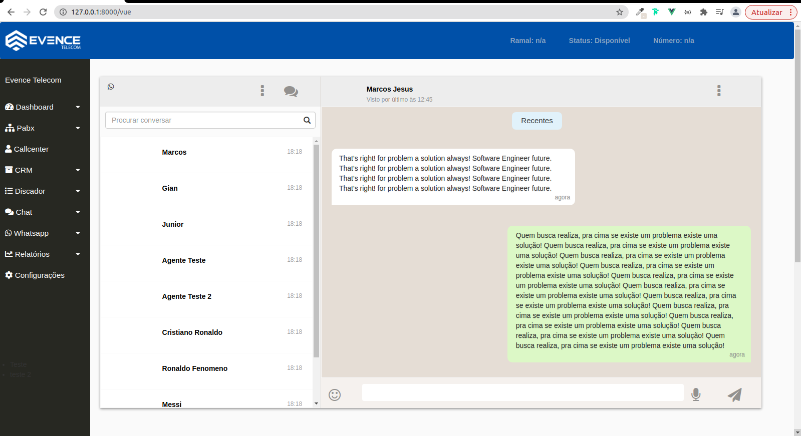

 With implementation Vue.JS in Blade Templates 

## Running this project

composer install

npm install

npm run dev

php artisan serve 

npm run watch

## License

The Laravel framework is open-sourced software licensed under the [MIT license](http://opensource.org/licenses/MIT).
